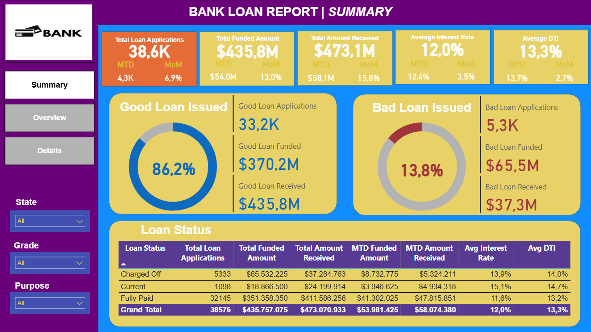
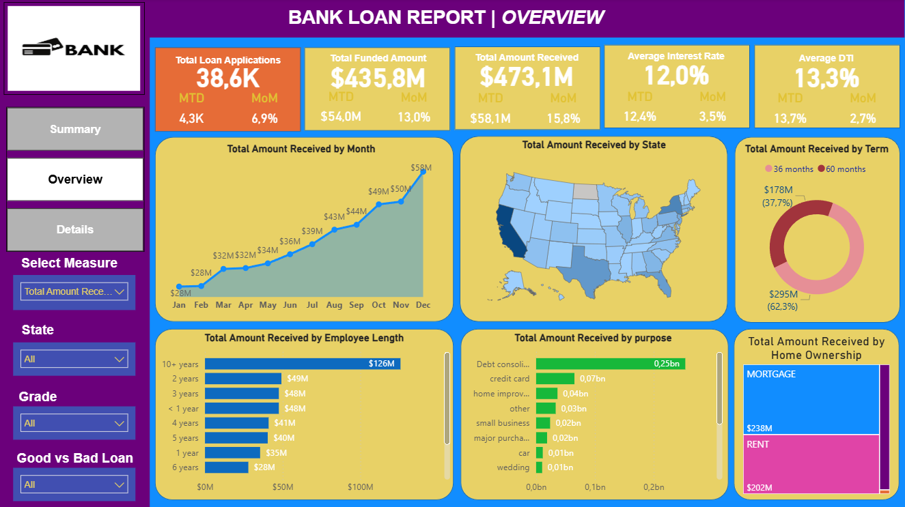
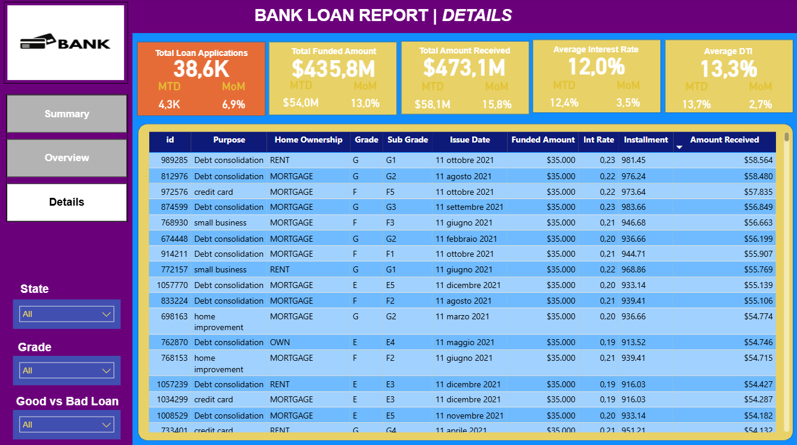

# Loan Portfolio Analysis – US Consumer Loans (2021)
End-to-end data analysis project using **SQL** and **Power BI** to analyze loan performance, borrower characteristics, and portfolio quality.

---

## Business Context

This project analyses consumer loan data from a US bank during 2021.  
The objective is to monitor loan volume, funding, repayments, and credit quality, providing insights that support **portfolio monitoring and risk assessment**.

---

## Dataset Overview

- **38,576** individual loan applications  
- **Time period:** January-December 2021  
- **Geography:** United States  
- **Granularity:** loan-level data  

The dataset covers borrower financial profiles, loan characteristics, interest rates, and repayment outcomes across different loan statuses.

---

## Data Source

The dataset used in this project is derived from the widely used **LendingClub loan data**, which contains anonymized information on US consumer loans issued during 2021.

The data has been cleaned and structured for analytical purposes and is widely used for educational, analytical, and portfolio projects.

The raw dataset is not included in this repository.

---

## Objectives & Key KPIs

The analysis focuses on the following KPIs:

- **Total Loan Applications** (MTD, MoM)
- **Total Funded Amount** (MTD, MoM)
- **Total Amount Received** (MTD, MoM)
- **Average Interest Rate**
- **Average Debt-to-Income Ratio (DTI)**

Additional analyses include:
- **Good vs Bad Loans** (credit quality)
- **Monthly trends** by issue date
- **Geographic distribution** by US state
- **Segmentation analysis** by:
  - Loan term  
  - Employment length  
  - Loan purpose  
  - Home ownership  

---

## Methodology

- **SQL** was used for data exploration, aggregation, KPI computation, and segmentation analysis.
- **Power BI** was used to build an interactive dashboard with dynamic time-based metrics (MTD, MoM).
- KPI definitions and aggregation logic are consistent across SQL and Power BI to ensure metric alignment.

---

## Project Structure
  - sql/        SQL queries for data overview, KPIs, and segmentation
  - powerbi/    Power BI dashboard (.pbix)
  - images/     Dashboard screenshots
  - README.md

---

## How to Use

1. Run the SQL queries in the `sql/` folder to explore the dataset and compute KPIs.
2. Open the Power BI file in the `powerbi/` folder to view the interactive dashboard.
3. Use the dashboard filters and time slicers to analyze MTD and MoM performance.
4. Refer to the screenshots in the `images/` folder for a static overview of the results.

---

## Dashboard Preview

---

## Key Insights

- Loan activity peaks toward the end of the year, showing clear seasonality.
- The portfolio is largely composed of good-performing loans (~86%).
- Bad loans account for a smaller share but show lower recovery rates.
- Clear differences emerge across borrower and loan segments.

---

## Tools & Skills

- **SQL**: data aggregation, KPI calculation, segmentation
- **Power BI**: dashboard design, DAX measures, time intelligence
- **Data Analysis**: trend analysis, portfolio monitoring, business interpretation